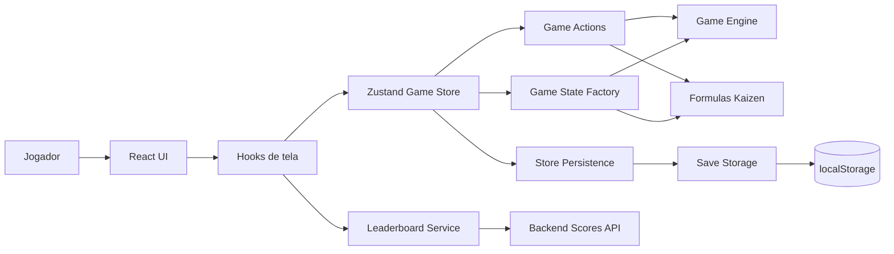

# Kaizen Clicker Frontend

Jogo incremental em React + TypeScript sobre melhoria continua em uma fabrica. O jogador ganha pontos com cliques, producao automatica e upgrades Kaizen. O ranking e enviado para uma API externa configurada por `VITE_API_URL`.

## Rodando localmente

```bash
npm install
npm run dev
```

Scripts uteis:

```bash
npm run lint
npm run build
npm run preview
```

Variavel de ambiente opcional:

```env
VITE_API_URL=http://localhost:3000
```

## Arquitetura



Principais responsabilidades:

- `src/store/useGameStore.ts`: composicao fina da store Zustand.
- `src/store/gameActions.ts`: acoes do jogo, como clique, compra, pause e tick.
- `src/store/gameStorePersistence.ts`: autosave, flush em unload e watcher de integridade.
- `src/store/gameStoreTypes.ts`: contrato de estado e acoes da store.
- `src/game/state/gameState.ts`: estado inicial, restore offline e serializacao.
- `src/game/engine/tick.ts`: calculo de producao por tempo decorrido.
- `src/game/engine/progress.ts`: aplicacao de producao nas metricas e historico.
- `src/game/formulas`: formulas de upgrades, OEE, qualidade e ritmo.
- `src/game/persistence/storage.ts`: leitura/escrita do save local com checksum.
- `src/game/antiCheat/limits.ts`: limites, sanitizacao e validacao de integridade.
- `src/hooks/useRankingController.ts`: polling, autosave e feedback do ranking.
- `src/services/leaderboardService.ts`: chamadas HTTP do ranking.

## Regra 2: background e offline ate 8h

O jogo salva o estado em `localStorage` e registra `savedAt` a cada autosave. Ao carregar a pagina, a store calcula quanto tempo passou desde o ultimo save e aplica a producao offline.

O limite maximo e `8 * 60 * 60` segundos. Qualquer periodo maior que 8h e truncado antes de gerar pontos.

Tambem foi ajustado o loop em aba aberta: quando o navegador reduz ou suspende timers em background, o proximo tick usa o tempo real decorrido, limitado pelas mesmas 8h. Assim a aba em background continua produzindo sem multiplicar ganhos acima do teto definido.

## Regra 7: deteccao de tampering no client

O save local nao e gravado como estado puro. Ele usa um envelope:

```ts
{
  version: 2,
  state: PersistedGameState,
  checksum: string
}
```

Estrategia usada:

- JSON invalido: o save e removido e o jogo inicia do zero.
- Formato invalido: o save e removido e o jogo inicia do zero.
- Checksum quebrado: o save e removido e o jogo inicia do zero.
- Inconsistencia detectavel: o save e removido e o jogo inicia do zero.

As inconsistencias verificadas incluem numeros negativos ou infinitos, `savedAt` muito no futuro, upgrades fora do nivel permitido, total de upgrades diferente da soma dos niveis, pecas boas + defeituosas diferente do total, pontos maiores que pontos vitalicios, historico invalido e metricas fora dos limites aceitos.

Quando isso acontece, a UI exibe um aviso claro ao jogador informando que o save local foi reiniciado.

O app valida o save ao carregar, antes de autosalvar e tambem durante a execucao. Isso evita que uma edicao manual feita pelo DevTools seja sobrescrita por um autosave valido antes de ser detectada.

Justificativa: checksum no client nao e seguranca forte, porque o codigo fica disponivel no navegador. Ele serve para detectar corrupcao e edicoes manuais simples no `localStorage`. A protecao real do ranking continua dependendo da validacao da API, enquanto o frontend evita restaurar um estado local obviamente adulterado.

## Polling e cache

O ranking faz polling a cada 5s. As chamadas HTTP usam `cache: 'no-store'` e headers `Cache-Control: no-cache` / `Pragma: no-cache`, evitando que o browser reaproveite respostas antigas durante o polling.
